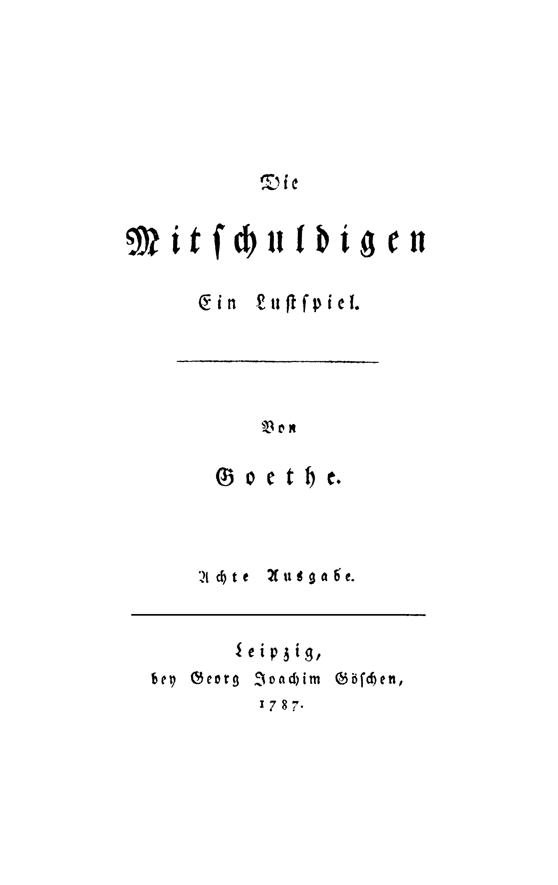
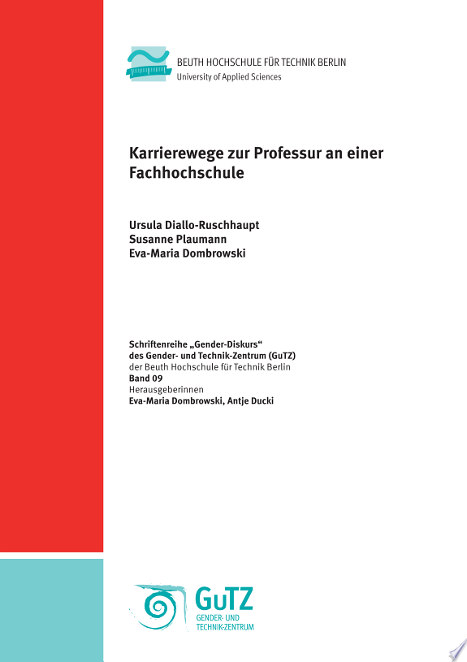

```{r, knitr_setup, include=FALSE}
## options for this document
doc_debug <- params$doc_debug
doc_refresh_data <- params$doc_refresh_data
knitr::opts_chunk$set("message" = doc_debug)
knitr::opts_chunk$set("warning" = doc_debug)
knitr::opts_chunk$set("tidy" = FALSE) # already tidyed using stylr

## local cached paths
doc_sample_image_path <- "oldmono_first.png"
doc_sample_thumbnail_path <- "newcover.jpeg"

## check for webshot if pdf output
doc_is_pdf <- 
  try (("pdf_document" %in% rmarkdown::all_output_formats(knit ::current_input())), silent=TRUE)
doc_is_pdf <- (doc_is_pdf == TRUE)
if (doc_is_pdf) {
  require("webshot")
  webshot::install_phantomjs()
}
```

```{css, css_setup, echo=FALSE}
@import url('https://fonts.googleapis.com/css2?family=Libre+Baskerville&display=swap');
body {
  font-family: 'Libre Baskerville', serif;
}
img
{
    display:block; 
    float:none; 
    margin-left:auto;
    margin-right:auto;
    width:80%;
    text-align:center;
}
.caption
{
    display:block; 
    float:none; 
    margin-left:auto;
    margin-right:auto;
    width:80%;
    text-align:center;
}
aside {
    float: right;
    color: blue;
}

/* aside mod from tufte.css but remapped to aside element */

aside {
    float: right;
    clear: right;
    margin-right: -60%;
    width: 50%;
    margin-top: 0.3rem;
    margin-bottom: 0;
    font-size: 1.1rem;
    line-height: 1.3;
    vertical-align: baseline;
    position: relative;
}
```

# **Exploring the Public Evidence on Open Access Monographs**

Micah Altman, CREOS Research Scientist

*[Draft: 12/1/2020]*

# Introduction

There is ongoing tension between the desire of scholars to share their work widely and openly, and the need to fund the infrastructure and labor of publishing. One place in which this tension is most evident is in the sale of scholarly monographs. While they are a only a small fraction of scholarly communications volume, market, and readership -- academic monographs continue to play an important role in the humanities and social sciences. They represent an important form of long-form scholarship -- not readily expressible through journal-length publications. And, as such, monograph publication through a university press forms a critical component of tenure evaluation -- sometimes independent of the extent to which the monograph itself is purchased, read, or cited. [@eve2014; @crossick2016]

{width="360"}

## Economic Pressures on Monograph Publishing

Monograph publication has been in crisis for approximately two decades. Changes in academic library collection policies --- driven, in part, by the serials crisis and the greater integration of purchase-on-demand workflows -- have led to traditional monograph publishing becoming generally unprofitable. [@crowa; @spence2018a] At the same time, there is an increasing demand among scholars, research funders, and the public that the outputs of scholarship be made open access. [@guédon2019; @scienceeurope]

There are many potential funding models for open monographs[@penierizabella2020; @adema]. Currently, a number of initiatives seek to promote consortial models involving both publishers and groups of libraries. These consortial models include library crowdfunding, membership fees, subscribe-to-open transition, and the direct funding of shared infrastructure. These models act to coordinate disciplinary communities (usually through libraries as representatives); enable publishers to streamline workflow for open digital publication; and reduce potential cost-risk (to publisher and reader).

These initiatives notwithstanding, open access monographs constitute a small fraction of the total monograph titles and in the near future, and will likely make up a few percent of monograph titles published annually. [@grimme2019]

## Reviewing the Evidence

Open monograph publishing remains in its early stages. The [CREOS](https://libraries.mit.edu/creos/) "The Economics of Scholarly Monographs" project is an examination of this area. This fall, as an initial step, we published an [annotated bibliography](https://libraries.mit.edu/creos/research/economics-of-scholarly-monographs/) that serves as a jumping off point for scholars to explore the effects of open availability on monograph revenues.

In this blog post we look at the open data available on monograph publication, and use it to explore patterns and trends in open monograph publishing. This blog post takes the form of a guided, interactive, reproducible data analysis based on currently available public data.[^1] We aim for this exploration to inform libraries, publishers, and authors about the landscape, and prepare for future transitions to open access.

[^1]: The source for the document is available [here](https://github.com/MIT-Informatics/monograph/blob/master/oamonoblog.Rmd). Since this blog takes the form of a fully replicable analysis, new versions may be released as the data sources it relies on are updated.

# Accessible Data on Open Monographs

The most complete index of open access monographs is the [Directory of Open Access Books](https://www.doabooks.org/) (DOAB), which lists tens of thousands of individual monographs (also known as 'titles'). DOAB makes its metadata index available as open data.

```{r, r_setup}
# core libraries for tidy data science in R
library(tidyverse)
library(magrittr)
if (doc_debug) {
  require(tidylog)
}

## the details of data retrieval in a separate module, included in our repository
## mono_load_* loads the named data as a R data frame from cache in github
## mono_fetch_* routines are used to retrieve a new version of data from canonical source

source("fetch_data.R")

## ISBN normalization and retrieval of open descriptive metadata based on 
## these are implemented through the isbntools python module
## we install these and provide a simple R wrapper (based on reticulate)
source("isbntools.R")

if (doc_refresh_data) {
  isbn_tools_init()
  mono_fetch_doab()
  mono_fetch_oapc()
}
doab_df <- mono_load_doab()
oapc_df <- mono_load_oapc()
```

The unique identifiers in the DOAB can be used to link it with other data sources. As an example, we can use the ISBN as a key to retrieve information from [Google Books]{.ul}. For example, we can retrieve and display the cover of the most recently added title:

```{r}
latest_book_isbns <- doab_df %>%
  arrange(`Added on date`) %>% 
  ungroup %>% slice_tail() %>% 
  select(`ISBN`) %>% 
  str_split(" ") %>% unlist() %>% as.character() 

if (doc_refresh_data) {
  cover_uri <- isbntools("cover",latest_book_isbns[1])[1,]
  # increase zoom level
  cover_uri %<>% str_replace("zoom=5","zoom=10")
  download.file(cover_uri, doc_sample_thumbnail_path )
}
```

{width="310"}

The DOAB data also provides links to the text of open monograph itself. The monograph content content is thus potentially available for harvesting, analysis, and integration with other sources. In practice, however, retrieving the content through DOAB may require some additional web scraping, as demonstrated below. For books also available in [Hathitrust]{.ul} obtaining the content through their apis is more reliable and straightforward.

```{r, getmonoimage}
### Capture image of first page of oldest open monograph
library(rvest)

## find the oldest book in DOAB and extract its URL
oldbook_url <- doab_df %>%
  arrange(`Year of publication`) %>%
  head(n = 1L) %>%
  select(`Full text`) %>%
  as.character()

if (doc_refresh_data) {
  ## retrieve book page follow metdata embedded in webpage
  require(rvest)
  oldbook_pg <- read_html(oldbook_url)
  pdf_url <- oldbook_pg %>%
    html_nodes(xpath = '//meta[@name="citation_pdf_url"]') %>%
    html_attr("content")

  ## retrieve book and extract first page as image
  require(pdftools)
  pdf_tmpfile <- tempfile(fileext=".pdf")

  download.file(pdf_url, pdf_tmpfile)
  pdf_convert(pdf_tmpfile, page = 1, dpi = 300, file = doc_sample_image_path)
}
```

Two other data sources are designed to provide additional information specifically about open access monograph titles:

-   The [OpenAPC](https://www.intact-project.org/openapc/) project provides title-level data on processing charges, supplied by a number of consortial initiatives.

-   [OpenBookPublishers](https://www.openbookpublishers.com/section/92/1) provides title-level usage data on the titles it publishes.

In addition there are a number of publicly accessible (not necessarily open) sources of metadata about large collections books generally. The most notable comprise:

-   *Descriptive Metadata:* ISBN registries including the service provided by [OpenLibrary](https://openlibrary.org/) can be used to obtain additional descriptive metadata for titles, including subject headings. The open [ISBNtools](https://pypi.org/project/isbntools/) package provides a standardized way of retrieving this data from a range of registries.

-   *Citations*: A limited number of monographs are assigned DOI's indexed in [CrossRef]{.ul}, open citation data is available through the [I40C initiative](https://i4oc.org/#faqs). Commercial services such as [Google Scholar]{.ul}, [Dimensions]{.ul}, and [Scopus]{.ul}, also include some citation information for selected books. This information is challenging to access systematically, but small collections can be extracted using Harzing's [Publish or Perish](https://harzing.com/resources/publish-or-perish) tool.

-   *Public domain works.* A range of books, including some monographs, are now open by virtue of coming out-of-copyright and into the open domain. These are not listed in DOAB -- however API's for [HathiTrust](https://www.hathitrust.org/data) and [JSTOR](https://www.jstor.org/dfr/) provide descriptive metadata, rights metadata, and text-analytic metdata (e.g. ngrams) for the (open) books in their collection.

-   *Prices:* Amazon provides [pricing API's](https://webservices.amazon.com/paapi5/documentation/use-cases/buying-price.html) that can be applied to monograph titles, and a number of third parties track Amazon price histories. This data is available under restrictive terms, and in small quantities.

# Explorations

In the table below you can browse a sample of titles:

```{r, doab_run}
## interactive sample data table
library(DT)
doab_df %>% 
  ungroup() %>% slice_head(n = 1000) %>%
  datatable(class = "cell-border stripe", caption = "Sample of DOAB Catalog",
            options = list(pageLength = 5), extensions = "Responsive")
```

## Dirty Data: Lather, Rinse, Repeat.

After browsing the DOAB sample for a short while, you will likely notice glitches There are many,including missing fields, typos; undocumented and inconsistent formats for names, dates, and identifiers; multiple values packed into a single field in undocumented and inconsistent ways. These 'dirty data' issues are not unique to DOAB, and are in fact, ubiquitous across the data sources we examined. For further data integration, at mininum, standardization of date and ISBN fields is required, as illustrated in the code below. [^2]

[^2]: Monographs are typically uniquely identified through an ISBN, which is also a common choice when linking across databases. However, each ISBN is associated with specific formats (e.g. paper, hardcover, digital), so a single work published in multiple formats will have multiple ISBN's. Further, the same ISBN may be expressed in multiple forms -- so normalization is essential ([ISBNtools]{.ul} is useful for this). Finally some databases will use DOI (digital object identifiers) or ASIN (Amazon standard identification number),instead of an ISBN. Generally the correspondence across identifiers must be resolved using an index: For DOI's there is a programatical mapping in theory to an ISBN13, but this often does not work in practice; and ASIN's printed works generally match the ISBN number, but kindle editions (and related digital works) are assigned new ASIN's.

```{r, doab_clean}
### Data Cleaning 
## address basic issues with:
## - date standardization 
## - ISBN list packing
## - ISBN format standardization 
## - non-monograph entries

library(lubridate)

## DOAB  basic data cleaning 
doab_df %<>%
  filter(`Type` == "book") %>% 
  mutate(
    DT_PUBLISHED_YR = year(parse_date_time(`Year of publication`, "y")),
    DT_ADDED_YR = year(parse_date_time(`Added on date`, "ymd HMS")),
      LS_ID_ISBNS = str_split(
           str_replace_all(ISBN, "[^0-9\\s]X*", ""),"\\s+")
     )  %>%
  mutate(LS_ID_ISBNS =lapply(LS_ID_ISBNS,isbntools,meth="ean13"))
```

## Looking at Change over Time

Following a basic cleaning, we can use the DOAB to examine broad trends and patterns in open monograph publishing. For example, consider this summary of open monograph publication volume over time:

```{r, timetrend}
library(plotly)
library(ggthemes)
tmp_plot <- doab_df %>%
  group_by(`DT_ADDED_YR`) %>%
  summarize(total = n()) %>%
  ggplot() +
  aes(x = `DT_ADDED_YR` , y = `total`) +
  geom_bar(stat = "identity") +
  geom_smooth() +
  scale_color_fivethirtyeight() +
  scale_x_continuous( breaks = c(2010,2012,2014,2016,2018,2020)) +
  theme_fivethirtyeight()
ggplotly(tmp_plot)
```

From this longitudinal overview, we can see that open monograph publishing is in its very early stages. Volume was quite small until five years ago, but has rapidly accelerated since then. However, progress is uneven, and after a record 2019 volume, there is a sharp downturn so far this year (noting that data for this year is not final) -- possibly due to the pandemic.

## Seeking Inclusion!

Since CREOS seeks apply evidence to understand how disparate communities can participate in scholarship with minimal bias or barriers, it is of particular interest to understand the communities of authors that are currently included in open monograph publishing. The DOAB database includes additional information about each title, such as the year of original publication, names of authors, and subject fields (and we can add to that through linking to other sources through the ISBN) -- however it contains no direct information about the characteristics of authors.

We can do better. As an early step, we can impute gender based on author names, and explore the inclusion of works authored by men and women over time.[^3]

[^3]: These imputations should be considered a very preliminary estimate, created for the purpose of promoting general discussion, potential issue spotting, and hypothesis generation. The process of imputation reflects only point estimates, and does not reflect uncertainty from several sources: including omissions in the original data sources, heuristic name extraction, and uncertainty in name to gender assignment. Further, the analysis treats gender as a binary category, and elides questions of adjusting for multiple authors.

```{r, doab_gender}
library(gender)
library(genderdata)
# NOTE, must use devtools:: install_github("ropensci/genderdata") for all methods to function
library(humaniformat)        

doab_df %<>% mutate(LS_NM_AUTHORS=str_split(`Authors`,";"))

# parse_names fails on empty strings, wrap it# gender can fail on genderize method
safe_first_name <- possibly(first_name, otherwise="")
safe_format_reverse <- possibly(format_reverse, otherwise="")
safe_gender <- possibly(gender, otherwise=list(gender=""))

doab_df %<>% rowwise() %>% mutate(LS_NM_AUTHORS_R = list(safe_format_reverse (str_squish(`LS_NM_AUTHORS`))))

doab_df %<>% rowwise() %>% mutate(LS_NM_AUTHOR_FIRST=list(safe_first_name(`LS_NM_AUTHORS_R`)))

doab_df %<>% ungroup() %>% rowwise() %>% mutate(LS_CAT_GENDERS = list(safe_gender(`LS_NM_AUTHOR_FIRST`,method="kantrow")[["gender"]]))

doab_df %<>% rowwise() %>% mutate(
  N_GENDER_MALE=sum(LS_CAT_GENDERS=="male",na.rm=TRUE),  N_GENDER_FEMALE=sum(LS_CAT_GENDERS=="female",na.rm=TRUE),
  )
```

```{r, pivotgender}
library(rpivotTable)
doab_pivot_df <- doab_df %>% transmute (
  'Publisher' = `Publisher`,
  'Opened Year' = `DT_ADDED_YR`,
  'Any Female Authors' = `N_GENDER_FEMALE`>0,
  'Number of Female Authors' = `N_GENDER_FEMALE`
)
doab_pivot_df %>% 
  rpivotTable(rows = "Any Female Authors", cols="Opened Year", vals = "Female Authors", aggregatorName = "Count as Fraction of Columns", rendererName = "Table Barchart"
              )
```

This preliminary estimate indicates that roughly thirty percent of open access monographs have at least one female author. And this proportion remains roughly steady over time. As OA monographs are dominated by the humanities, where over fifty percent of US Ph.D. recipients (and over forty percent of faculty in most humanities disciplines) this suggest a need to evaluate systemic bias in who is included in open monograph publishing.[^4]

[^4]: This is a formative, not summative analysis, and should be approached with caution. The gender imputation process contains many sources of unmodeled uncertainty; the analysis uses a US baseline, but the data does not support excluding non-US authors. Further this does noty imply that bias in OA, if any, is worse than in scholarly publishing in general, since no baseline for gender inclusion in a comparable sample of non-open monographs has been established.

## Follow the Money?

Business and economic models will need to evolve in order for monograph publishing to continue. The available data provides some hints (but only hints) on the economics of OA monograph production. The most comprehensive data fully-open data is provided through the OAPC project, and records book processing charges for the major consortial monograph purchasing initiatives.

We can use this data to look at fee-based revenue for presses participating in consortial open-monograph publishing arrangementgs. The most 'profitable' publishers are shown below:

```{r}
library(lubridate)
## oapc cleaning
oapc_df <- mono_load_oapc()
oapc_df %<>%
  mutate(
    DT_ADDED_YR = year(parse_date_time(`period`, "y")),
    ID_ISBN_PRINT = lapply(`isbn_print`, isbntools, meth="ean13"),
    ID_ISBN_MAIN = sapply(`isbn`, isbntools, meth="ean13"), 
    ID_DOI_ISBNA =  lapply(`isbn`, isbntools, meth="doi"), 
    )
oapc_df %<>% 
  rowwise()%>%
  mutate(LS_ID_ISBNS = list(
    setdiff(unique(c(`ID_ISBN_PRINT`,`ID_ISBN_MAIN`)), "")
            ))
```

```{r }
library(scales)
publisher_df <- oapc_df %>%
    group_by(publisher) %>%
    summarize(
      N_PUBS = n() , 
      TOTAL_REVENUE = sum(euro), 
      AVG_CHARGE = TOTAL_REVENUE/N_PUBS
    ) %>% 
    arrange(desc(TOTAL_REVENUE))


rev_plot <- publisher_df %>% 
    slice_head(n=25) %>% 
    ggplot(aes(x=reorder(publisher,TOTAL_REVENUE),y=TOTAL_REVENUE)) + 
    geom_bar(stat="identity") +
    scale_color_fivethirtyeight() +
    scale_y_continuous(label=comma)+
    theme_fivethirtyeight() +
   labs(title = "Total Revenue (Euros) by Top Publishers", x = "Publisher", y = "Revenue") +
  coord_flip()
ggplotly(rev_plot)
```

Estimates of cost of producing monographs vary considerably, the most extensive study to date, estimated a range of average costs of approximately thirty to forty thousand dollars per title. [@maron2016] What does the OAPC data show?

```{r  }
library(plotly)
library(crosstalk)
library(ggthemes)
fees_plot <- oapc_df %>% ggplot(aes(euro,DT_ADDED_YR)) + geom_bin2d(bins=10)+ 
 scale_color_fivethirtyeight() +
  theme_fivethirtyeight() +
   labs(title = "Book Processing Charges (in Euro) by Year", x = "Charge (Euro)", y = "Year)", color = "Number of Publications") 
ggplotly(fees_plot)

```

The most typical book charges in the data are approximately two thosand euros and ten thousand euros for converted-to-open and published-as-open monographs (respectively). These modes and the overall range is substantially under the range that would be expected from prior surveys. [^5]

[^5]: Note that the BPC charge does not necessarily reflect the entire cost of publication. However, the consortial initiatives included in the data above aim for the BPC to recover the costs of publication for born open materials. So the range of BPC charges should include the range of publication costs.

# Future Puzzles ...

The exploration above raises a number of questions -- under what conditions does the open availability of the monograph impact prices and sales? What are mediating factors -- does the length or subject of the monograph mediate sales effects? What are potential mechanisms at play?

This exploration is limited by existing data. Each individual press has information on the sales, costs, and usage of the monographs they publish. If pooled, this data could answer potentially answer deeper questions about the economics and utility academic monographs, and could guide a transition to open access models.

# About this Document

This is a reproducible document. The most straightforward way to examine and modify the source is to clone the module using [git]{.ul} and then load the project using [Rstudio]{.ul}. The source is available [here](https://github.com/MIT-Informatics/monograph/blob/master/oamonoblog.Rmd), and follows tidyverse style guidelines (using [styler]{.ul} and [lintr]{.ul} for conformance checking).

This analysis relies primarily on the [R]{.ul} language, with [python]{.ul} for the [ISBBNtools]{.ul} library. We make extensive use of the [Plot.ly]{.ul} graphics package, and open R libraries (especially [tidyverse]{.ul}, [gender]{.ul}, [htmlwidgets]{.ul}, and [crosstalk]{.ul} and [Baker's R Makefiles]{.ul}).

All references in this document are managed in [Zotero,]{.ul} We use tidyverse style guidelines

The authors describe contributions to this Essay using a standard taxonomy (see [\@allen2014]) Micah Altman provided the core formulation of the essay's goals and aims, and led the writing, methodology, data curation, and visualization. Chris Bourg and Sue Kriegsman contributed to conceptualization and provided review. CREOS research assistant Shelley Choi provided assistance with preliminary data visualization and software implementation.

<aside>

This work is Copyright 2020 Massachusetts Institute of Technology, and is Licensed under the Apache License, Version 2.0 (the "License"); you may not use this file except in compliance with the License. You may obtain a copy of the License at <http://www.apache.org/licenses/LICENSE-2.0>

Unless required by applicable law or agreed to in writing, software distributed under the License is distributed on an "AS IS" BASIS, WITHOUT WARRANTIES OR CONDITIONS OF ANY KIND, either express or implied. See the License for the specific language governing permissions and limitations under the License.

This work was conducted with support from the Center for Research and Equitable and Open Scholarship at the Massachusetts Institute of technology.

</aside>

# References
